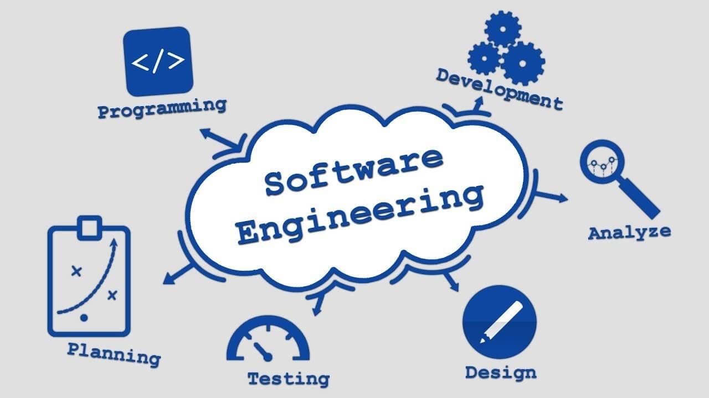

Before I took this class I was excited because I was told that you learn about web application development, but when I started I found out that I  would learn more than that. I learned many fundamental software engineering concepts as well. I enjoyed experiencing what it is like to not just work with web development, but also what comes along with it. Three of my favourite topics during this course were: 

## Coding Standards

Coding standards are a set of guidelines that have been set by a software development organizations. They act as guidelines that need to be followed by every developer that is working on producing an application. They were set in place to help aid the production of high-quality code that is easy to follow and maintain. It helps reduce the risk of errors or bugs in any code because as the project becomes big and more complex, it can become more vulnerable to all types of errors. These standards help develop software programs work smoothly in the end.

In my final project I learned first hand how important it is to follow a coding standard. It helps team members really work together in a more efficient way. I found that when we actually stuck to a coding standard, everyone's work was easier to comprehend. It was difficult at times to go back and read some of my team members work to try to expand the functionality of our website. To me, this was an eye-opener to why these standards are so important when working in a large company team. 

I had openly talked about trying to fix bugs and working off of code that wasn't mine to some of my friends who are already working as software engineers in large companies, and how I was starting to understand why coding standards are important. They all replied with no hesitation, explaining to me that once they started working in their large companies they really learned how to properly follow standards and why it is so important. In fact, they said that they now don't understand why people don't learn this in the beginning of their degrees. It definitely helps to make even working by yourself easier as well. My favorite use of the coding standard that I used throughout this course was that it would notify me if a variable has not yet been defined or used. It helped me either set up what was necessary or cut out what wasn't. It really helped with the small errors I would have overlooked. I am very glad that I learned how important and useful coding standards will be to me in the future. 

## Ethics in Software Engineering

Ethics in software engineering is a very large topic, which I feel I just scratched the surface of. It can be defined as ["the application of both computer science and engineering philosophy, principles, and practices to the design and development of software systems."]( https://en.wikipedia.org/wiki/Software_engineering_professionalism) This opens up the topic in a massive scale. However, I do feel like I got a deeper understanding of it as I began to work on a web application. In my first application I self-assigned a sign up page. In this I had placed an "I accept the terms and conditions" check-box that was required to be marked to make an account. I didn't make an actual file for the user to then read them. When my team and I had asked people to try our website, the most common response was "What are the terms and conditions? What exactly am I agreeing to giving you?" I was surprised by this, but then I remembered that I am technically being given real information, such as emails and birthdays. 

I feel like trying to be ethical in the future might be hard, just because it's the little things we don't often think about. Yet what we either purposefully or accidentally overlook can be extremely important to the user. I plan on being very midful of it in the future now, as it is so important not just to me and my future employers, but aslso to the user. 

## Functional Programming

L

## User Interface Frameworks

B