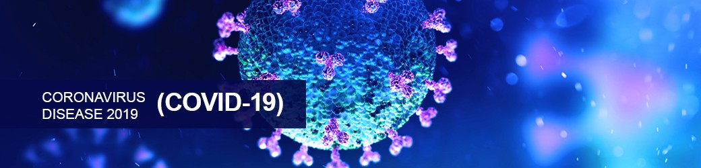

In December of 2019, China experienced a pneumonia outbreak that has now spread to all corners of the world. As a result, a mandatory quarantine has been implemented and has forced everyone to change their lives to slow down this pandemic. Schools were forced to go online so that people can still work towards their degrees and graduate on time. 

## Lovin’ every minute of it…

In my daily routine I (like most of the world) have experienced a few changes. The biggest change for me has been that I no longer leave my house to attend classes. This isn’t a big change for me though. Throughout my intermediate and highschool education I was enrolled in an online school that taught me how to juggle school and an at home routine. I have always been a homebody so the adjustment hasn’t been hard on me. The long hours indoors and lack of interaction with people in a social setting is actually where I find that I am most comfortable, which results in me being more productive.

## Now no one is working for the weekend…

Even though I am enjoying staying home, there have been some negative outcomes. I currently have two jobs while in school, as a tutor for ICS classes at a community college and a sales associate in retail. The mandatory quarantine means that I am not able to go into work. Like most of the world, it has left me stressed about how I am going to be able to support myself. Luckily I have been able to continue tutoring online, so I do have one source of income in this troubling time. 

There has also been some added stress regarding my personal life. Both of my parents have underlying health conditions and I have been very worried about how this pandemic can affect them. While my father is able to take off time from work, my mother currently supports and rescues sick or abandoned animals in her community. I was luckily able to visit my parents to help them get set up before any travel bans were implemented. 

## Turn me loose…

Lots of people have become stir-crazy due to the mandatory quarantine put in place. It is important that we all follow the rules set in place though. I feel that this is the only way to successfully battle this pandemic and save as many lives as we can. People are still under the assumption that this is only affecting older people and those with underlying health issues, but it is taking the lives of young and healthy as well. Everyone needs to think larger than themselves and be more compassionate to those around them. I also feel that the people in charge, like the government, need to be more honest about what is happening and is going to happen. They need to educate everyone properly and not give rise to the mass hysteria. In America, I think it is unacceptable for someone to say that “if we are lucky, only 100,000 people will die.” Hopefully people realize that we all need to follow the rules and put in the work to overcome this. 
