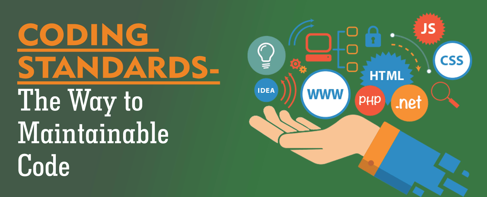

The Five Ws are a guideline of questions that should be asked when trying to learn, gather information, and problem solved. You can apply this to the topic of coding standards to get a real understanding of the topic:

## What are coding standards exactly?

Coding standards are a decided set of guidelines, practices, programming styles and conventions that developers follow when writing code for a project. It helps reduce the risk of failures as code can become very complex when working in groups, and it can become more vulnerable to errors without it. These standards help develop software programs work smoothly in the end. Four weeks into the semester we started using IntelliJ while implementing ESLint and the AirBnB JavaScript Coding Standards. This was very interesting and helpful to work with because the AirBnB JavaScript Coding Standards is actually used worldwide and is being implemented by many large companies. These standards teach us how to write code that is more efficient and easier to comprehend. 

## Why are coding standards so important exactly?

Everyone who codes has a different and personalized way of writing, but because everyone is different it can lead to confusion when working in a group. Once out in the field you are expected to work with other people on collaborative projects, and if everyone is writing code in their own personal way it will get confusing and messy fast. This is fine until a bug appears in the thousands of lines of code and your team has to fix it. Coding standards can reduce the time it takes to find the bug and fix it. 

## When and where should you use coding standards?

Coding standards should be used when working on any project really, but it’s understandable to use not use it when working on small personal projects. A developer should make sure to follow coding standards of a company whenever working on professional code, whether it be a collaborative or solo project. 

## Who should use coding standards?

Everyone! Every person that plans on writing code should have an idea of how to follow and understand coding standards. Even as a student, I have been made aware of how important and easy it is to work with them. In a few projects I have used ESLint and found that it has been very helpful in working through my code. One Of my favourite things about esLint is the green check mark as it helps with maintaining code standards for adjusting errors like formatting issues, incorrect spacing, and even helping locate defined variables that have never been utilized yet. While using ESLint with IntelliJ, it helped me see errors written in my code and I was able to correct them instantly to make the code work for my projects. Even as a student I can see how this will be helpful in collaborative pieces in the future by helping me understand other people’s code quickly. Which means I will spend less time trying to decipher what is going on in the project so far, and have more time to help finish it. I can only imagine how helpful coding standards could be to any programmer attempting any large, or even small, programs.
