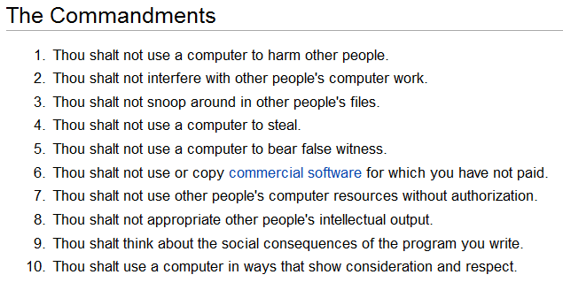

## “Software engineers shall participate in lifelong learning regarding the practice of their profession and shall promote an ethical approach to the practice of the profession.” -ACM software engineering code of ethics

When I was assigned to write about my stance on software engineering and computer ethics, I found myself wondering how many people actually pay attention to their moral obligations when creating software for large companies, or even just themselves. I brought the topic up with my roommate who had very strong opinions on the topic, particularly about data collection. She was extremely upset about learning that most websites, not all though, do collect information without her being aware. To which I wondered, they do inform you of this in terms and conditions (although it is now legal to gather this information without informing a user), why accept them if you are not okay with it? Do you really care if you don’t take the opportunities to stop them? Why don’t you clear your cookies daily? Why don’t you log out of social media when browsing the internet? Sure, it doesn’t solve all the problems but if no one is even attempting to fight against it, then why is it such a big deal for them? The answer in my head was that even though it is ethically wrong, most people enjoy the benefits of data collection. They enjoy going back onto a website and having their username and password already written out for them, they enjoy coming back to a website and having their site preferences remembered, or even that their shopping basket still has those items they were not sure about buying. 

What people don’t enjoy is websites collecting information on who they are, where they’ve been, who they’ve been talking to, and what they’re interested in. So where is the line of ethics for developers and software engineers? A software engineer can be responsible to collect user data and to show more relevant ads. Yet, if the engineer fails to create a secure system to keep hackers from stealing personal information then they are putting their users at risk. Users could end up paying the price with doxing, identity theft, forfeiture of privacy, and so many more consequences. So isn’t it the software engineers' responsibility to make sure that this doesn’t happen? Isn’t it harmful to not make sure that users are safe? 

I believe that we as software engineers have a moral obligation to ensure the safety, privacy, and wellbeing of those who benefit from our services. I believe while trying to ensure the best and expand the functionality in any software, we should never lose sight of the people using it. As developers, we can often forget that we are being trusted with personal information, and have to follow ethics codes just like many other professions have to. For instance, while discussing with my roommate as mentioned above, she said that as a future doctor she will be given information not only about a person’s physical health, but their social security number, their contact information, their family’s information, and more. Doctors have a moral obligation to not release, sell, or manipulate their patients with this data. They are meant to help their patients in any way possible and make sure they leave happy and healthy. This should be the same idea for software engineers, to not harm a user but to help them with what they need and have them leave happy. As far as data collection goes, I agree that there can be many benefits from it, but if it is at the cost of the user being safe then it is not worth it. 
