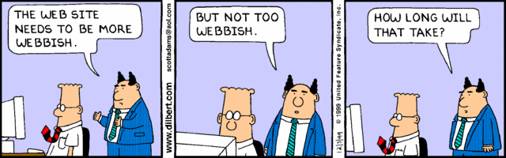

layout: essay
type: essay
title: Coding Standards
# All dates must be YYYY-MM-DD format!
date: 2020-02-12
labels:
  - Computer Science
  - Semantic UI
  - HTML
  - CSS
---

## More than black and green…

           When I first started writing code, I loved seeing the lines and lines in neon colours against a black screen. It made me feel like I had finally achieved something that I had only been able to observe being done before. There was something comforting and “pretty” about it and it filled me with excitement at the start of a new career for me. However, three years after my first “Hello World," I realized that I had lost some of the excitement when looking at one of my programs in Javascript. HTML, CSS, and Semantic UI managed to bring back that excitement for me. Actually having a visual representation of what my code can do has me eager to write lines and lines of code again. HTML and CSS opened the door to a sleek and clean looking UI, when used correctly, which was a huge departure from what I’ve worked with before. Semantic UI took what I learned from this and allowed me, as a programmer, to create responsive, clean, and highly customizable interfaces. I find that they are inspiring me to be more creative with my coding.  

##But it’s all fun and games until you need to center a logo... 

           While learning to use HTML and CSS, I was very excited to start seeing what my coding could do. I had created a GUI before, but it was the very basics and created in Java. HTML and CSS excited me because I was able to create so much more with less work. So imagine my excitement when I started to learn and work with the Semantic UI framework! I personally didn’t find my experience with it to be frustrating or a huge investment in time. I thoroughly enjoyed working with this UI framework. Except for when I needed to center something on the page, then it was a screaming match between me and IDE. I think that it got me to think in ways that I feel HTML and CSS didn’t. 

##My future with UI...

           If I end up deciding to focus on web development in my future, I don’t believe that I’ll be using a lot of semantic UI. While I really enjoyed learning how to use it, the development on it seems to be slow or at a stand still. The framework of it is great and has inspired me to explore different front-end development frameworks. In summary, I loved learning how to use semantic UI and can’t wait to take what I’ve learned from it into the real world. 
