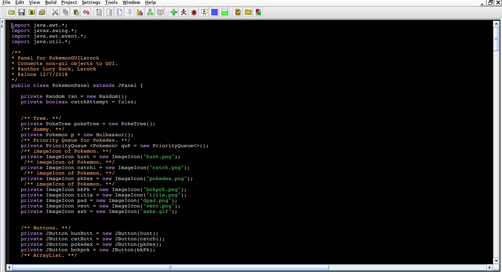
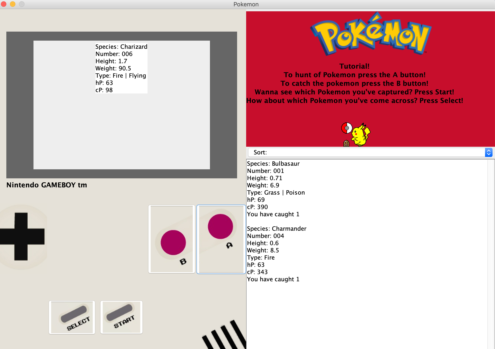

  
  

  A Graphical User Interface (GUI) is an interface that allows a user to interact with a program by using images and buttons to let the computer know what to do. It is a way to easily communicate with electronic devices. We can do this by using icons, menus and other graphical  representations to show information and give the user control without having to type commands in text. GUIs were created to give a more attractive and  convenient covering for command line programs, making it effortless for the user. 

  One of my favourite projects that I have created using JAVA was a Graphical User Interface that was meant to resemble a Pokemon game. In this project I used an Object Hierarchy,, a Binary Search Tree, and an ArrayList. The hierarchy was used to sort pokemon by the species, element type, and evolutions of the three original starter Pokemon(Charmander, Squirtle, and Bulbasaur). I used this GUI to hunt, catch, and display Pokemon to the user. A user could click the ‘Hunt’ button and Pokemon, which was chosen at random, would appear on screen. The user could then try to ‘Catch’ the Pokemon that appeared, or ‘Hunt’ for another one. If the user tried to catch the Pokemon, it could either get away or be stored in to the user’s ‘backpack’ When the Pokemon was caught it was added into an ArrayList that we could sort. The main purpose of the backpack was where the user could see what Pokemon they have captured. They can also choose to sort them by what was caught recently or by their number in the Pokedex. The user’s Pokedex is where information about the Pokemon they have come across, not just caught, is stored. The Pokedex was created by using a binary search tree.  They could also sort both the Pokedex and Backpack by the Pokemon’s HealthPoints’ and ‘Combat Points’ using a drop down menu.  

  I was the only programmer working on this project. It was created over a couple months by piecing together many other projects over my introduction to Computer Science II class. Being the only programmer working on this project allowed me to take creative control over how the GUI appeared to the user and how it worked. However, I had peers of mine test out the program and make sure that it was still a user friendly program that was easy to use. This project showed me what it would be like to work in the app development field, and taught me how to deal with dynamic data structures. 

