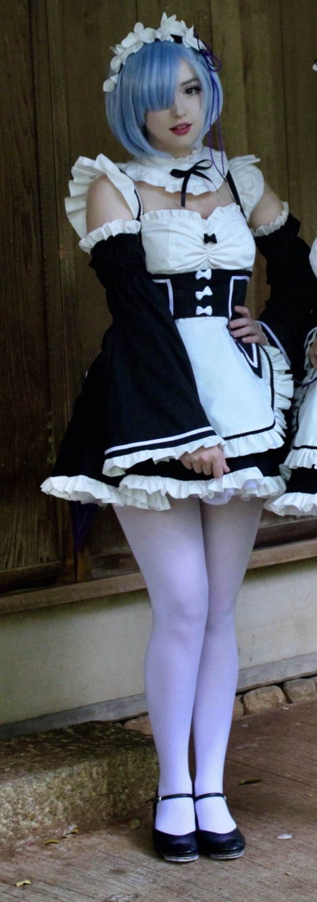
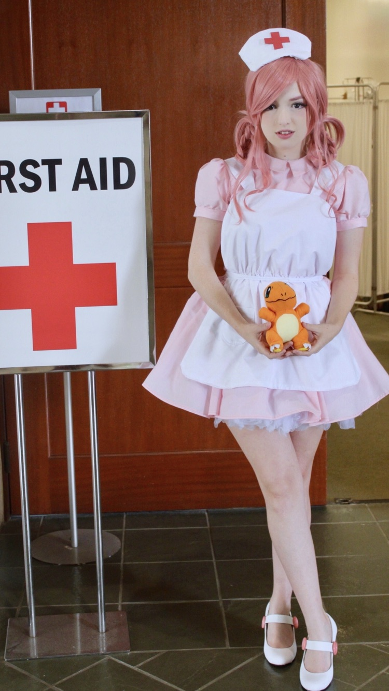

  When I was younger I wanted to become a costume designer for fantasy/ sci-fi movies. I have taken years of sewing classes and am able to make patterns for a lot of different things. My younger sister had asked me once to make a costume for me and her to wear to a convention that we were going to. For this project I needed to make two whole costumes, and I chose to add on another costume at the last second. I had one week to complete these costumes, while juggling other responsibilities at the time.

  The pattern making was the most difficult part of these projects, it requires lots of research beforehand and tons of measurements to keep track of. The most interesting thing about this part of costume making is the math and critical thinking needed to make them. You start off with a blank piece of paper and either create each piece from measurements, or start from a very basic pattern shape and manipulate it into what you want. For the costumes I made, I chose to create a basic pattern from measurements that I had taken of myself and my sister, and then alter it to fit the design. The costumes were based off an animated series, so they were very over the top are required me to learn new techniques in a short amount of time. The sewing process of the project required me to utilize good time management skills, as it is the lengthiest part of the whole task, and creative problem solving. When I ran into problems with the costumes, I did not have time to start everything over so I had to come up with quick ways to fix them.

  The whole project, which ended up involving three whole costumes being made, ended up being finished on time and executed well. I took on all of the responsibilities of creating them, but did get help from my sister with a few of the smaller details. This project was important for me to practice time management, work under stress, and creative problem solving. 
  
*Two of the costumes that I handmade from scratch, the other person did not want to be included*
 
