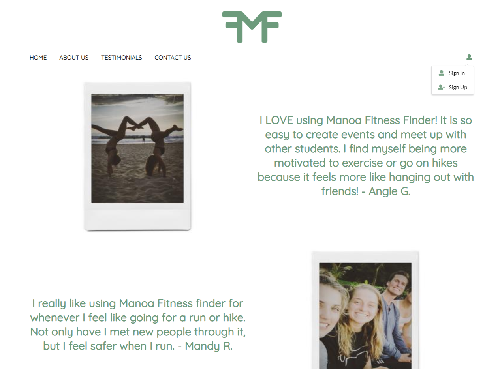
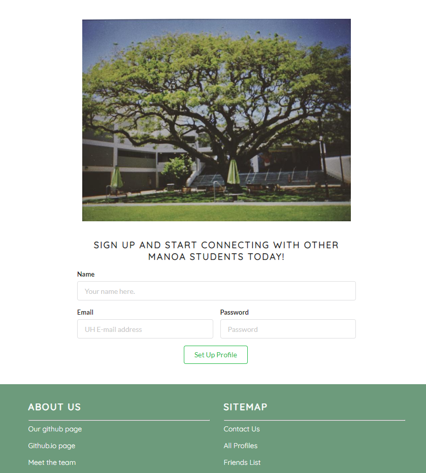
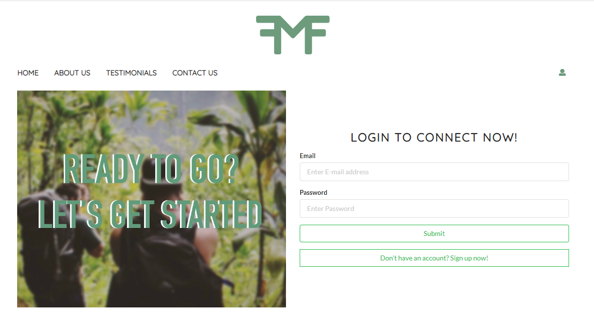

## Manoa Fitness Finder

My final project in my Software Engineering (I) class involved me working in a group of five to create a website that could be useful to students on my campus. My team was given the idea to create a fitness website that could connect students across campus that want to socialize and exercise together. We came up with the idea of Manoa Fitness Finder, an application that allows students to log in and create a profile that specifies their gender, interests, level, “looking for”, and goals. It allowed them to interact with one another through comments, create events for meetups, add friends, and find new upcoming events. 

## My part in the project

In the first group meeting, my team members and I split up responsibilities. Two members and I volunteered to work on and set up the design of the website. I was responsible for designing the navigation menu, the header, the login page, the sign-up page, the testimonials page, and the contact page. Later on a group member and I took on the job of creating the comment section found on all the profiles, having them list not only the comment but the date, user name, and image of the person who left it. We also added on the ability to click on the image to go to the user's profile. In the end I worked on all the navigation and re-directions of the page. 

## What I learned from this project

I feel that my understanding of how to work with Meteor and MongoDB has improved a lot since I completed this project. It has left me with an extreme appreciation for the development skills that go into creating an application like this, and I think that I have been able to collect and improve my software engineering skills. I cannot wait to practice making an application again, and I am also very excited to take what I've learned and used it in a professional setting. 

If you would like to take a look at the project, it can be found <a href="https://github.com/manoafitnessfinder/app">here</a>.