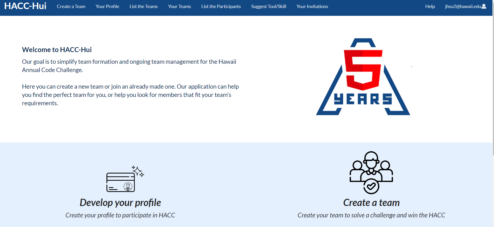
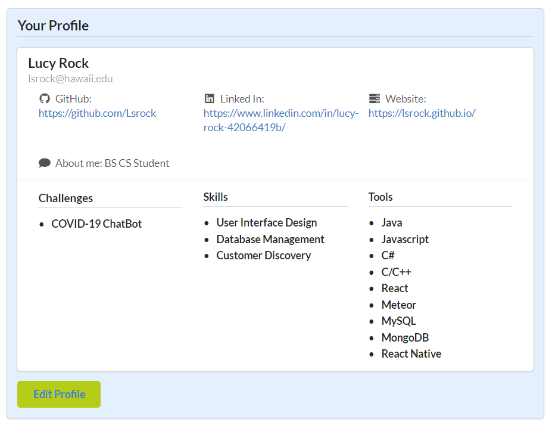
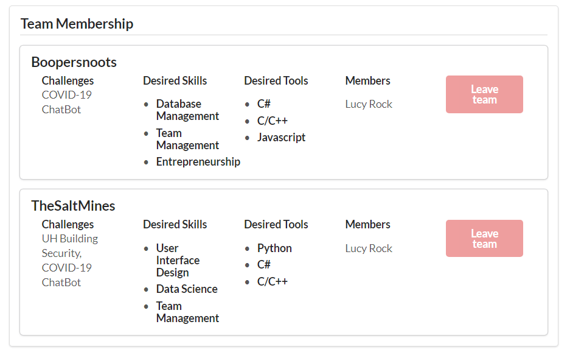
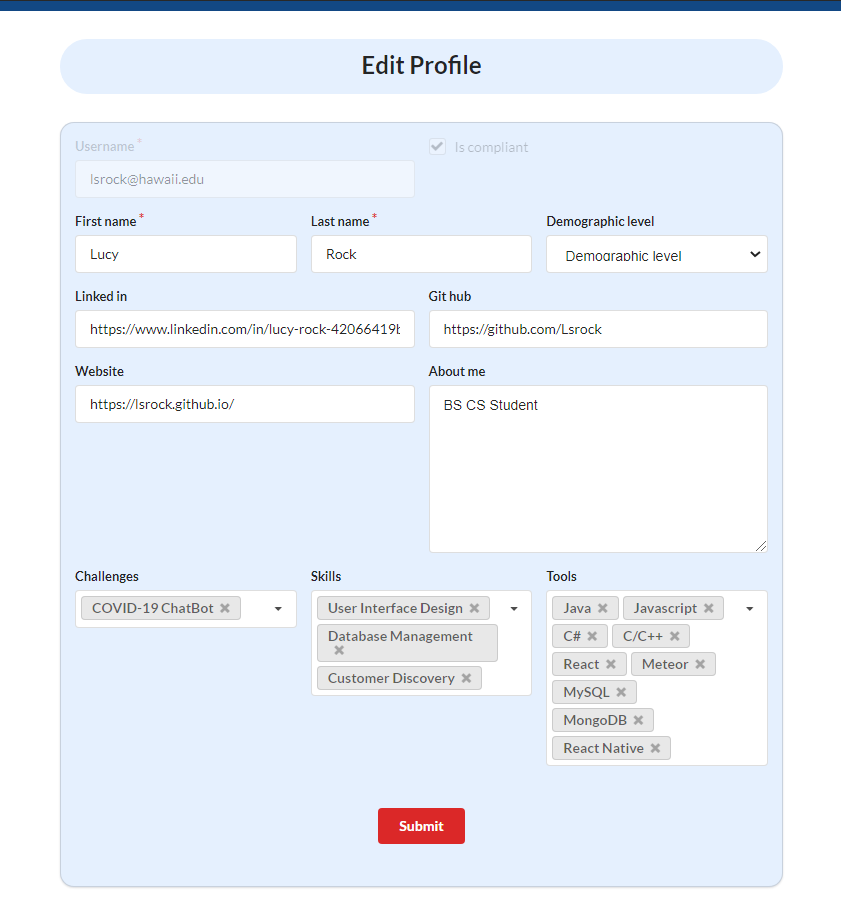
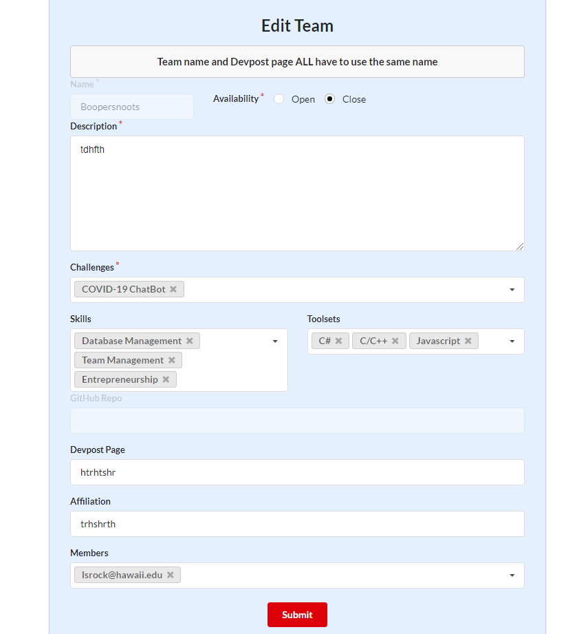

## HACC HUI

The Hawaii Annual Code Challenge <a href="https://hacc.hawaii.gov/">(HACC)</a> is a hackathon that is held by Hawaii every year.  <a href="https://hacc-hui.github.io/">HACC HUI</a> was created to provide a user-friendly system that would allow users to form teams in a simple way.  They could view profiles and interact with other people looking to form a team. It was built using React, MongoDB, Meteor, and Semantic-UI.

I was placed in a team with Jennifer Hsu, Kelli Tamashiro, and James Bennett. Our team process was that we would assign certain issues to work on ourselves. Then we would meet up twice a week to discuss and present our progress on the issue. If anyone had fallen behind, then we would try to help them catch up. We communicated largely through discord, and we all worked in the same repository. We shared the same amount of responsibilities. We were all responsible for attending the meetings, answering questions, and presenting. 

## MileStones: 
Throughout the project, we were assigned three milestones. The first milestone had four issues in it. They were:
	Configure HACC
	Login & profile
	Create team
	Delete HACC Hui account
	From these four issues, I worked on the Login & Profile issue. For this, I was in charge of setting up the login page (1), a displayed profile, a participation acknowledgment page, and an edit profile page. 

 

 

Milestone Two had four  additional issues :
	Update team
	Delete team
	See best-fit teams
	Indicate desire to join
	For this milestone, I worked on the update team issue. For this, I needed to make sure it met all the requirements, such as having a unique team name and implement a multi-select field for the challenges, skills, and tools. 

For Milestone Three, the new issues were assignment and all teams started to work on the master repository for the application. Out of the many issues assigned, I was in charge of creating a leave team function that would notify the team’s creator using a Slack DM. I was also responsible for making sure that the configure HACC page was on the theme, involving the color scheme, and making sure that there were no design bugs. I also worked on the edit team page and the navigation bar. 

## My Experience:
My overall experience in ICS 414: Software Engineering II was a good one. I am happy I decided to take this course because I feel like it has shown me a glimpse of what to expect when working in a team once I graduate. I learned a lot about how keeping updated with your team members is important, as well as a lot of new web development knowledge. I think the project itself went well, despite the rushed time frame. I am proud to say that I was a part of the teams that made HACC HUI. 

## Links:
<a href=https://hacchui.ics.hawaii.edu/#/">Running site HACC HUI</a>
	
<a href="https://github.com/400-iq/HACC-Hui">Team's Github</a>
	
<a href="https://github.com/HACC-Hui/HACC-Hui">Master</a>
	
<a href="https://hacc-hui.github.io/">Detailed Description of project</a>
